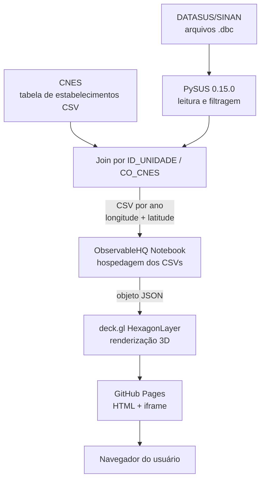

# 26_1-geovisualizacao-interativa-dengue

**Título do TCC: Geovisualização Interativa da Dengue no Rio de Janeiro**
**Alunos: Gabriel Moraes Ferreira**
**Semestre de Defesa: 2026-1**

[PDF do TCC](/paper/Geovisualizacao%20Interativa%20da%20Dengue%20no%20Rio%20de%20Janeiro.pdf)

# TL;DR

Para rodar o mapa:
1. Navegar até a pasta `interactive-map/src`.
2. Subir o servidor com `$ python -m http.server 8080`.
3. Acessar `localhost:8000` no navegador.

Para rodar a pipeline:
1. Navegar até `sinan-pipeline`.
2. Abrir o notebook.
3. Rodar a seção "Instalação" (remover os sinais de `!` caso não esteja no Colab).
4. Rodar a seção "Download dos dados (default de 2014 à 2023)".
5. Na seção "Filtros", alterar `path = "/caminho/do/arquivo.dbc"` para o ano a ser convertido para CSV.
6. Rodar a seção "Filtros".
7. Na seção "Join e conversão", descomentar a linha `#ano = 2023 (substituir pelo ano do arquivo)`.
8. Alterar `estab = pd.read_csv("/content/tbEstabelecimento202603.csv", ...)` para o caminho da tabela de estabelecimentos do CNES.
9. Rodar a seção "Join e conversão".

# Descrição Geral

Este trabalho apresenta uma aplicação web de geovisualização tridimensional e interativa dos casos de dengue no município do Rio de Janeiro entre os anos de 2014 e 2023, utilizando dados públicos do SINAN (Sistema de Informação de Agravos de Notificação) obtidos via DATASUS. A visualização é gerada com o framework deck.gl e ObservableHQ, hospedada via GitHub Pages e acessível por qualquer navegador moderno, sem necessidade de instalação.

O repositório também contém a pipeline reprodutível em Python responsável pela extração, processamento e georreferenciamento dos dados, que pode ser reutilizada para outras doenças e períodos disponíveis no SINAN.

A usabilidade da aplicação foi avaliada com o questionário SUS (System Usability Scale) com 14 participantes, obtendo score médio de 86,61, classificado como "Excelente".

# Funcionalidades

* **Mapa interativo 3D**
  * Visualização dos casos de dengue e dengue grave do município do Rio de Janeiro em colunas hexagonais tridimensionais (HexagonLayer do deck.gl)
  * Navegação por arraste, zoom e rotação
  * Seletor de ano para alternar entre os dados de 2014 a 2023
  * Detecção automática de dispositivo com guia interativo adaptado para Desktop e Mobile

* **Guia de utilização integrado**
  * Roteiro de cinco passos que conduz o usuário pela exploração do mapa
  * Link direto para o questionário SUS ao final do guia

* **Pipeline de dados reprodutível**
  * Download e leitura de arquivos `.dbc` do SINAN via PySUS 0.15.0
  * Filtragem por município (Rio de Janeiro, código IBGE 330455) e classificação final (dengue: 10, dengue grave: 12)
  * Georreferenciamento por cruzamento com a tabela de estabelecimentos do CNES
  * Exportação em CSV pronto para consumo pelo deck.gl

# Arquitetura

# Dependências

**Pipeline de dados** (rodar no Google Colab ou Linux):
* [Python 3.x](https://www.python.org)
* [PySUS 0.15.0](https://github.com/AlertaDengue/PySUS)
* [pandas](https://pandas.pydata.org)
* libffi (`apt-get install libffi-dev`)

**Dados externos necessários:**
* Tabela de estabelecimentos do CNES em CSV — download em [cnes.datasus.gov.br](https://cnes.datasus.gov.br/pages/downloads/arquivosBaseDados.jsp)

**Aplicação web** (sem instalação necessária para uso):
* Qualquer navegador moderno com suporte a WebGL
* Para rodar localmente: Python 3.x (apenas para subir o servidor HTTP)

# Execução

**Mapa interativo (versão online):**

Acesse diretamente via GitHub Pages: `https://gabemoraes.github.io/tcc-dengue/`

**Mapa interativo (versão local):**
1. Navegar até a pasta `interactive-map/src`.
2. Subir o servidor com `$ python -m http.server 8080`.
3. Acessar `localhost:8000` no navegador.

**Pipeline de dados:**
1. Baixar a tabela de estabelecimentos do CNES (ver seção Dependências).
2. Navegar até `sinan-pipeline`.
3. Abrir o notebook no Google Colab ou ambiente Linux.
4. Rodar a seção "Instalação" (remover os sinais de `!` caso não esteja no Colab).
5. Na seção "Filtros", alterar `path = "/caminho/do/arquivo.dbc"` para o caminho correto do arquivo do ano escolhido.
6. Rodar a seção "Filtros".
7. Na seção "Join e conversão", descomentar a linha `#ano = 2023` e substituir pelo ano do arquivo.
8. Alterar `estab = pd.read_csv("/content/tbEstabelecimento202603.csv", ...)` para o caminho da tabela do CNES baixada.
9. Rodar a seção "Join e conversão".
10. O CSV resultante estará pronto para ser carregado no notebook do ObservableHQ.